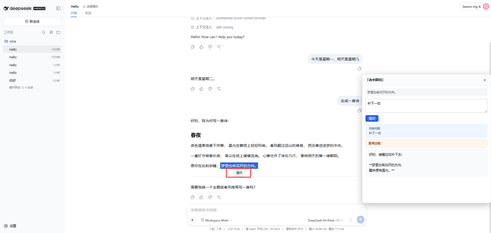

# dsh-sidebar-assistant（选中即问）

一个面向 DSH（DeepSeek Harness）Web 界面的侧边栏助手插件。在 Web 聊天界面里**选中任意文本**，即可基于所选内容发起提问，模型会参考**当前会话的对话历史**与**选中的引用文字**作答，并在浮层面板里**流式**显示思考过程与最终回答。

使用场景：deepseek主对话对连续话题的理解问答，dsh-sidebar-assistant插件生成的对话框，主要用户临时不解进行回答，这样不污染主对话内容，并且省token，因为插件对话框只引用选中文字及其涉及的这段对话。当有临时发问，请在插件会话问吧。

## 功能特性

- **选中即问**：在 Web 界面选中一段文字，点击文字下方“提问”，浮层面板自动弹出，所选文字作为引用。
- **流式输出**：回答实时逐字渲染，无需等待全部生成完毕。
- **思考过程折叠**：模型的思考过程（reasoning）与最终回答分开显示；思考过程默认折叠，可点击「思考过程」展开查看。
- **会话上下文**：自动带入**选中所处会话**的对话历史作为上下文（不含其他历史会话），并严格以引用文字为准、不臆测引用之外的事实。
- **面板可拖拽 / 可缩放**：标题栏拖拽移动浮层；四角与四边拖拽调整面板大小。
- **Enter 提交**：输入问题后直接按 `Enter` 即可提问。
- **引用当前会话**：自动带入选中所处会话的历史消息（仅当前会话，不混入其他会话）。



## 环境要求

- Node.js `^22.19.0` 或 `>=24`
- 已安装并可用 `dsh` CLI（`@deepseek-ai/dsh`），并存在可用的 Web 配置文件（`--profile web`）
- 已配置可用的 LLM Provider（插件复用 harness 的 LLM 服务，使用默认模型 `deepseek-v4-flash` 等）

## 安装

插件以 `link:` 方式安装到目标 profile，指向源码目录，便于本地开发调试。

### 1. 安装依赖

```bash
cd dsh-sidebar-assistant
pnpm install
```

### 2. 构建

```bash
pnpm run build
```

构建产物输出到 `lib/`（host 逻辑为 `lib/index.js`，client bundle 为 `lib/client.js`）。

### 3. 安装到 DSH

```bash
npx -p @deepseek-ai/dsh dsh plugin --profile web add dsh-sidebar-assistant
```

安装后插件会以 `link:` 方式记录在 profile 的 `package.json` 中，源码目录的改动在重新构建后即可生效。

### 4. 重启 harness

```bash
# 停止旧进程（如有）
pkill -9 -f "dsh web"
# 启动
dsh web
```

启动后打开 Web 界面，在会话中选中一段文字即可使用。

> 说明：由于以 `link:` 安装，**改代码后需重新 `pnpm run build` 并完全重启 harness**（仅刷新页面可能不生效）。

## 使用

1. 打开 DSH Web 聊天界面，进入任意会话。
2. 用鼠标选中一段文字（作为引用）。
3. 浮层面板自动弹出，输入你的问题。
4. 按 `Enter` 或点击「提问」按钮提交。
5. 面板中：
   - **「你的问题」**：展示本次问题。
   - **「思考过程」**：模型思考链（默认折叠，可点击展开）。
   - **回答卡片**：模型最终回答，流式实时显示。
6. 拖动**标题栏**移动面板；拖动**边框或四角**调整大小；点右上角 `×` 关闭。

## 配置

插件支持以下可选项（写入 harness 的插件配置）：

| 配置项 | 类型 | 默认值 | 说明 |
| --- | --- | --- | --- |
| `enabled` | `boolean` | `true` | 是否启用插件 |
| `provider` | `string` | `''` | 指定 LLM Provider（留空则自动探测） |
| `model` | `string` | `''` | 指定模型（留空则自动探测） |
| `systemPrompt` | `string` | `''` | 自定义系统提示词（追加到默认提示之上） |
| `personaText` | `string` | `''` | 自定义人设文本（追加到默认提示之上） |
| `persistDir` | `string` | `.sidehelper` | 问答记录的持久化目录 |
| `maxQuotedChars` | `number` | `4000` | 引用文字的最大字符数（超长截断） |
| `placeholder` | `string` | `输入你的问题…` | 提问框占位文案 |

Provider / Model 留空时，插件会依次尝试：当前活动调用 → harness 默认会话模型（`agentDefaultModel`）→ 手动配置 → 自动探测首个可用 Provider。

## 项目结构

```
dsh-sidebar-assistant/
├── src/
│   ├── index.ts          # 插件入口（host 导出）
│   ├── host/
│   │   ├── index.ts      # 导出 apply/Config 等
│   │   ├── web.ts        # 插件主体：SSE 流式 ask、配置探测、持久化
│   │   ├── llm.ts        # LLM 流式调用（区分 think/delta）
│   │   ├── context.ts    # Prompt 组装（会话历史 + 引用 + 问题）
│   │   ├── config.ts     # 插件 Schema 配置
│   │   ├── persistence.ts# 问答记录持久化
│   │   └── stream.ts     # 流式文本累积工具
│   ├── client/
│   │   ├── index.ts      # client 侧：注入、选中触发、SSE 拉取
│   │   ├── panel.ts      # 浮层面板 UI（拖拽/缩放/流式/思考折叠）
│   │   └── selection.ts  # 选中文本监听
│   └── types/
│       └── index.ts      # 共享类型
├── lib/                  # 构建产物
├── cordis.patch.yml      # bundle patch
├── tsdown.config.ts      # client bundle 打包配置
├── tsconfig.json         # host TypeScript 配置
└── tsconfig.client.json  # client TypeScript 配置
```

## 故障排查

| 现象 | 可能原因 | 处理 |
| --- | --- | --- |
| 面板没出现 | 未选中所处会话 / 插件未生效 | 确认进入会话并选中文本；重启 harness |
| 一直「生成中…」 | 浏览器或 host 端请求挂起 | host 端已内置 30s LLM 超时、前端 65s 兜底；检查 Provider 网络/凭证 |
| `host ask failed: HTTP 500` | Provider 未注册 / 凭证或端点错误 | 检查 `.dsh/settings.yaml` 的 `provider`、`baseURL` 与凭证；参考日志 `.sidehelper/ask-error.log` |
| 改代码不生效 | `link:` 安装需重新构建 + 完整重启 | 重新 `pnpm run build`，并 `pkill -9 -f "dsh web"` 后重启 |
| 请求 `/plugins/.../client.js` 失败 | 缓存 / harness 未重启 | 完全重启 harness，浏览器强制刷新 |

## 协议

遵循 DSH 生态的 MIT 协议（见仓库许可证）。
